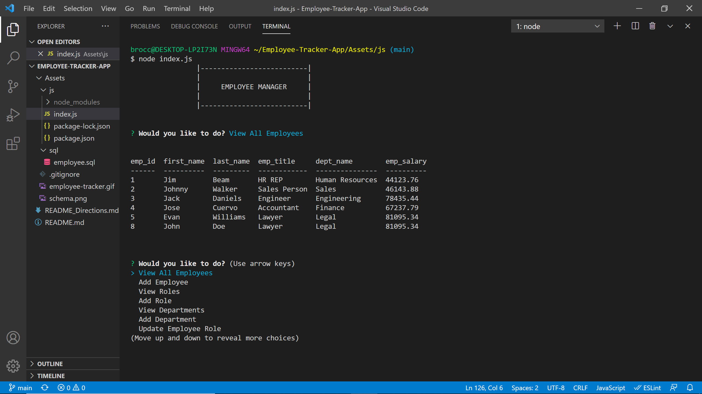

# Employee-Tracker-App

## This application represents an emplyee management system. The user can view all employees, add employees, view and add roles, view and add departments, and remove employees. The application uses inqquirer and mysql to to get user input and store and retrieve from the database.
